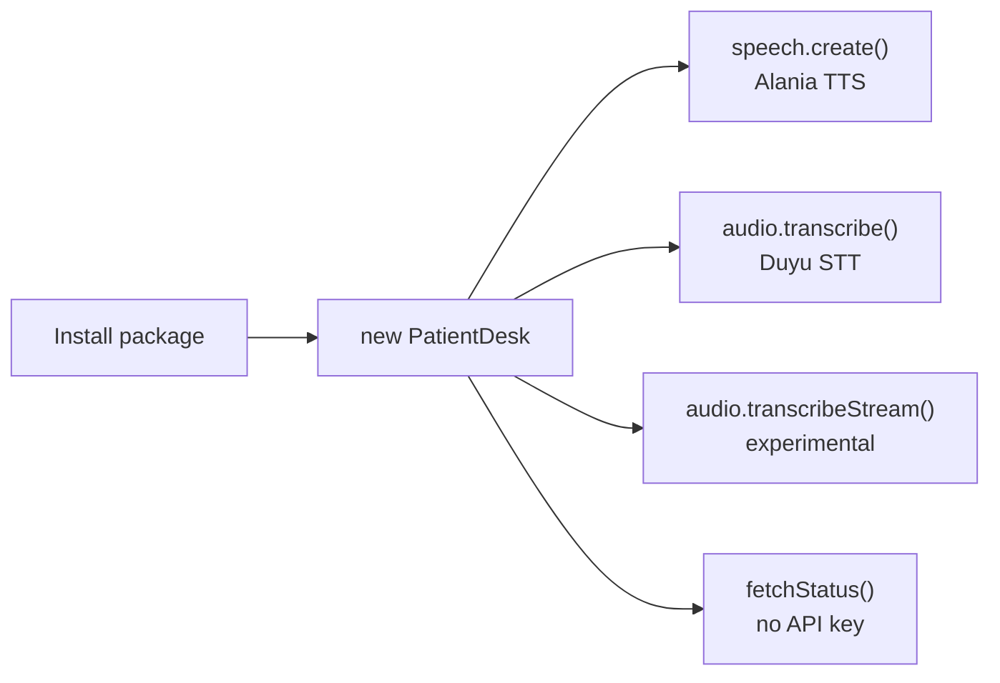

# Getting started

`patientdesk-sdk` is an **unofficial** client for PatientDesk's Turkish voice
models. It wraps **Alania** text-to-speech and **Duyu** speech-to-text, plus a
keyless Statuspage health check. It has zero runtime dependencies and uses the
global `fetch` and `WebSocket`, both of which can be injected.

> Not affiliated with, endorsed by, or supported by PatientDesk. It is an
> independent client for their public, OpenAI-compatible API.

## Overview



**Need:** [Node.js 20+](https://nodejs.org/), an API key from
[speech.patientdesk.ai](https://speech.patientdesk.ai). Deno, Bun and edge
runtimes work too, since only standard globals are used.

## 1. Install

```sh
npm install patientdesk-sdk
```

## 2. Set the API key

The client reads `PATIENDESK_API_KEY`, falling back to `PATIENDESK_KEY`. You can
also pass it directly to the constructor.

```sh
# macOS / Linux
export PATIENDESK_API_KEY="pd_live_..."

# Windows PowerShell
$env:PATIENDESK_API_KEY="pd_live_..."
```

## 3. First request

```ts
import { PatientDesk } from "patientdesk-sdk";

const pd = new PatientDesk({ apiKey: process.env.PATIENDESK_API_KEY });

// Text to speech (Alania)
const speech = await pd.speech.create({
  input: "Randevunuz oluşturuldu.",
  response_format: "wav",
});
const wav = new Uint8Array(await speech.arrayBuffer());

// Speech to text (Duyu)
const { text } = await pd.audio.transcribe({
  audio: wav,
  audio_format: "wav",
  language: "tr",
});
console.log(text);
```

## 4. Health check (no key)

```ts
import { fetchStatus, isOperational, statusDescription } from "patientdesk-sdk";

const status = await fetchStatus();
console.log(statusDescription(status)); // "All Systems Operational"
console.log(isOperational(status) ? "up" : "degraded");
```

## What is on the client

| Member | Type | What it does |
| --- | --- | --- |
| `pd.speech` | `SpeechApi` | Alania text-to-speech. |
| `pd.audio` | `AudioApi` | Duyu speech-to-text, REST and streaming. |
| `pd.baseUrl` | `string` | Resolved API base URL. |
| `pd.apiKey` | `string` | Resolved API key. |
| `pd.fetchImpl` | `typeof fetch` | The `fetch` in use. |
| `pd.wsImpl` | `WebSocketConstructor` | The `WebSocket` in use, if any. |

## Where to go next

- [Node.js recipes](recipes.md): speak, transcribe a file, use the microphone.
- [Text to speech](text-to-speech.md): every Alania parameter and output shape.
- [Speech to text](speech-to-text.md): formats, timestamps, subtitles.
- [Streaming](streaming.md): the experimental WebSocket session.
- [Errors](errors.md): retries, backoff and rate limits.
- [Testing](testing.md): how to run the offline and live suites.

## Not sure it is us

Add `PATIENDESK_BASE_URL` to point the client at a proxy or a mock, and inject a
custom `fetch`. See [Configuration](configuration.md).
